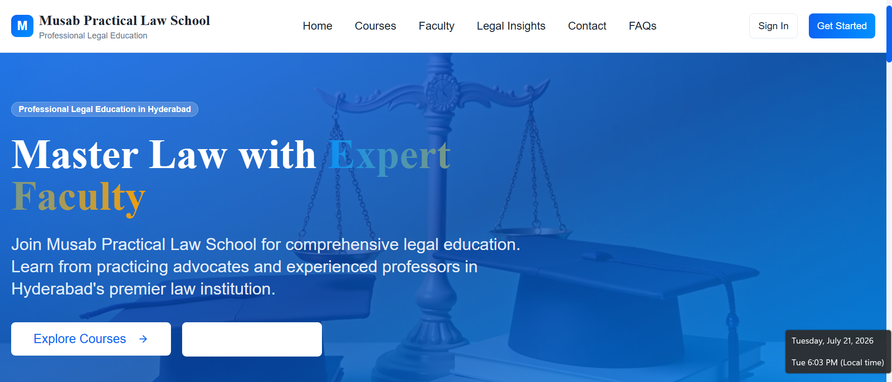
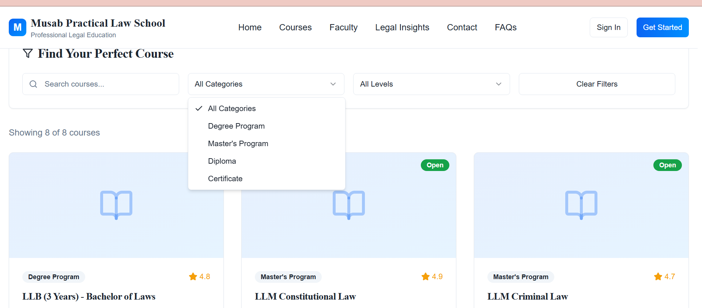

<p align="center">
  
</p>

<h1 align="center">⚖️ Musab Practical Law School</h1>

<p align="center">
  <strong>AI-Powered Learning Management Platform for Legal Education</strong>
</p>

<p align="center">
A modern Learning Management System designed to provide students, faculty, and administrators with a seamless digital learning experience.
</p>

<p align="center">


</p>

---

# 📖 Overview

Musab Practical Law School is an AI-powered Learning Management System (LMS) developed for legal education.

The platform enables students, faculty members, and administrators to access courses, manage learning materials, monitor academic progress, and collaborate through a modern, secure, and responsive web application.

The goal of this project is to make legal education more accessible, interactive, and technology-driven while providing an intuitive user experience.

---

# ✨ Features

- 👨‍🎓 Student Dashboard
- 👩‍🏫 Faculty Dashboard
- 🛡️ Admin Dashboard
- 📚 Course Management
- 🔐 Secure Authentication
- 📈 Student Progress Tracking
- 📱 Responsive Design
- ⚡ Fast Performance
- 🎯 User-Friendly Interface

---

# 🛠️ Tech Stack

| Category | Technologies |
|----------|--------------|
| Frontend | React, TypeScript, Tailwind CSS |
| Backend | Supabase |
| Database | PostgreSQL |
| Authentication | Supabase Auth |
| Deployment | Vercel (Coming Soon) |

---

# 📸 Project Screenshots

## 🏠 Home Page

<p align="center">

</p>

---

## 📚 Courses Page

<p align="center">

</p>

---

## 📊 Dashboard

> *(Upload dashboard.png later and remove this note.)*

<!--
<p align="center">

</p>
-->

---

# 📂 Project Structure

```text
musab-law-school-project
│
├── public
├── screenshots
│   ├── banner.png
│   ├── homepage.png
│   ├── courses.png
│
├── src
├── README.md
├── package.json
└── vite.config.ts
```

---

# 🚀 Getting Started

Clone the repository

```bash
git clone https://github.com/rashidaqaiyumi/musab-law-school-project.git
```

Go to the project folder

```bash
cd musab-law-school-project
```

Install dependencies

```bash
npm install
```

Run the project

```bash
npm run dev
```

---

# 🎯 Future Improvements

- 🤖 AI Legal Assistant
- 📜 Certificate Generation
- 🎥 Video Lectures
- 📊 Analytics Dashboard
- 💬 Discussion Forums
- 🔔 Notifications
- 🌙 Dark Mode

---

# 👩‍💻 Author

**Rashida Qaiyumi**

Artificial Intelligence & Data Science Graduate

📧 Email: rashida969qaiyumi@gmail.com

💼 LinkedIn: <https://www.linkedin.com/in/rashida-qaiyumi-412708210/>

⭐ If you like this project, don't forget to give it a star!

---

<p align="center">
Made with ❤️ using React, TypeScript, Tailwind CSS & Supabase
</p>
